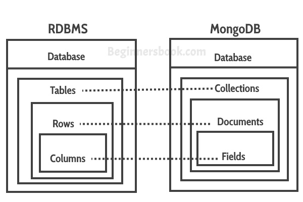

# Document-oriented databases

A document-oriented database stores the data in so-called documents (pretty obvious). A document can be seen as an object in JavaScript, something that has a couple of keys with values associated with it. Have a look at the following introduction video:

<a href="https://www.youtube.com/watch?v=Nh6Y7DgZDrg">

</a>

## Coming from SQL

In our sections on document-oriented databases we are assuming you have SQL knowledge. The following diagram should help identify the terms used in document-oriented databases to relate them to what you know in SQL (courtesy of www.beginnersbook.com):



For example, let's consider the following object in json format:

```json
{
  "_id": ObjectId("528ba7691738025d11aab772"),
  "proj_no": "123",
  "proj_name": "WebDevDatabase",
  "project_tags": ["lastyear", "backend", "javascript"]
}
```

This can be stored in a document-oriented database just like that with no extra validation or data conversion. In an SQL database it would look like this:

```sql
| proj_no | proj_name          | start_date   | project_tags                           |
| ------- | ------------------ | ------------ | -------------------------------------- |
| 123     | “WebDevDatabase” | “2019-12-30” | "lastyear, backend, javascript" |
```

Although this goes against some of the relational rules, so it should be stored in first normal form:

```sql

| proj_no | proj_name          | start_date   | project_tag  |
| ------- | ------------------ | ------------ | ------------ |
| 123     | “WebDevDatabase” | “2019-12-30” | "lastyear"   |
| 123     | “WebDevDatabase” | “2019-12-30” | "backend"    |
| 123     | “WebDevDatabase” | “2019-12-30” | "javascript" |
```

This should already show one of the advantages of using a document-oriented database. But we will go into what each way of storing data brings in another section.

## Getting practical (MongoDB)

We will keep the theory short as a lot of the concepts of databases will be similar to the sql sections and we assume you have that knowledge already. For the practical part of document-oriented databases we will be using MongoDB and its syntax. It is important to note that this is not the only option, but it is the most used which is why we will use it. Try to keep in mind that this is an implementation of the document-oriented database theory and it is not synonymous as a lot of tutorials online make it out to be.
